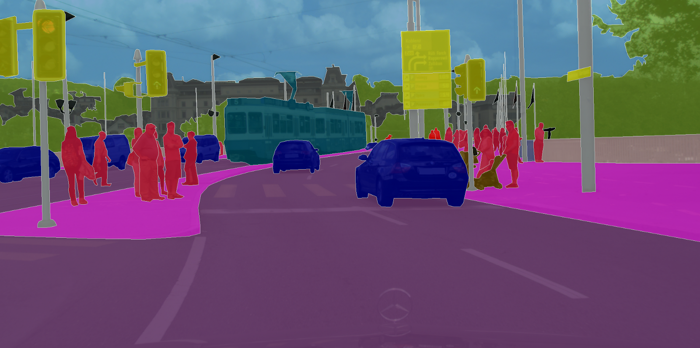
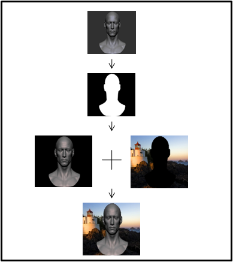
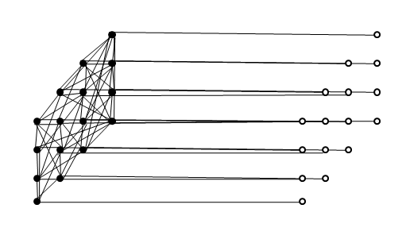
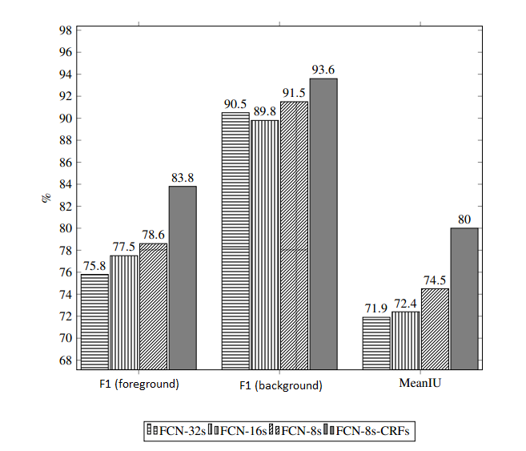

# Semantic - Segmentation
The algorithm proposes the new combination between FCN and CRFs. Split the foreground from the background and automatic replacing another background optionally.

## Abstract 

The semantic image segmentation technique has many applications in digital graphics, determines the exact location of the object described in the image and cuts, edits them, brings interesting experiences, attracts innovative ideas to form the useful applications. The author's approach direction is to create an application that is capable of separating photo fonts, bringing uniqueness when the object can appear with many different backgrounds even if taken from one place.

In this report, the author uses the calculation method of Fully Convolutional Network (FCN) to reduce the sample and increase the sample by transposed convolution to bring the meanIU index on the assessment set (130 images) equals 74.5% and conditional random fields technique with optimal KL-divergence method (Inference=20, Scale=0.7) gives meanIU index equal to 80.0%. The application allows to adjust parameters and combine different types of background images.

Keywords: semantic image segmentation, fully convolutional network, conditional random fields

## Fully Convolutional Network
FCN is a neural network and capable of reducing sample and increasing again for extracting features from images.

## Conditional Random Fields
CRFs is a statistic model helping FCN produces more valuable information and estimating the probability more correctly

## Results
Special comparing data from a specific dataset with FCNs and CRFs

